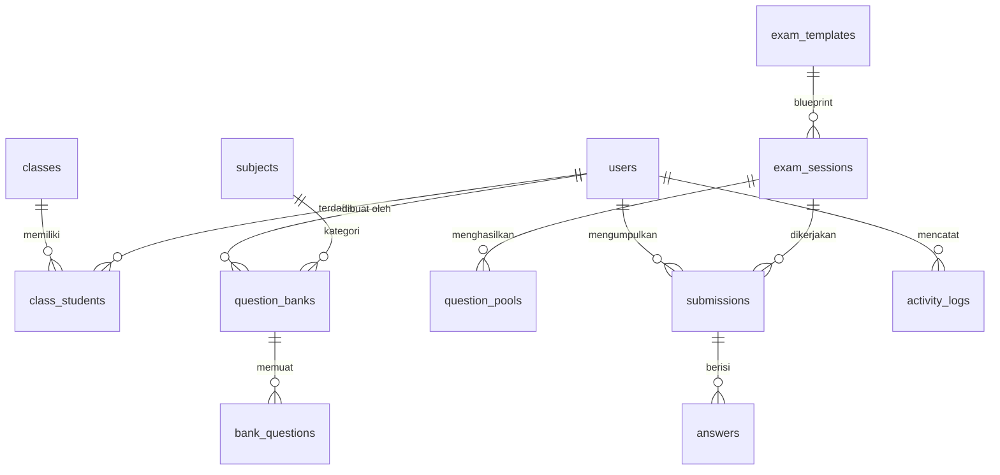

# 🗄️ Dokumentasi Skema Database CartaExam

Dokumentasi resmi arsitektur basis data **CartaExam** (SMAN 1 Campurdarat). Basis data dirancang secara agnostik menggunakan **Drizzle ORM** yang mendukung 3 provider database utama: **SQLite** (Development/Local), **MySQL / MariaDB** (Production Server), dan **PostgreSQL** (Enterprise).

---

## 🏗️ Struktur Modul Basis Data

---

## 📑 Rincian Tabel Utama

### 1. Entitas Inti (`users`, `subjects`, `classes`, `class_students`)
- **`users`**: Akun pengguna sistem (Admin, Guru, Siswa).
  - Kolom: `id` (PK UUID), `name`, `username` (Unique), `password` (bcrypt), `role` (`admin` | `teacher` | `student`), `createdAt`.
- **`subjects`**: Mata pelajaran sekolah.
  - Kolom: `id` (PK UUID), `name`, `code` (Unique), `description`, `createdAt`.
- **`classes`**: Rombongan belajar / kelas siswa.
  - Kolom: `id` (PK UUID), `name`, `grade` (10 | 11 | 12), `academicYear`, `teacherId` (FK users), `createdAt`.
- **`class_students`**: Penempatan siswa di dalam kelas (Aturan integritas: 1 siswa terdaftar di 1 kelas aktif).
  - Kolom: `id` (PK UUID), `classId` (FK classes), `studentId` (FK users), `enrolledAt`.

---

### 2. Bank Soal (`question_banks`, `bank_questions`)
- **`question_banks`**: Koleksi soal berdasarkan mata pelajaran dan kurikulum.
  - Kolom: `id` (PK UUID), `subjectId` (FK subjects), `name`, `description`, `createdBy` (FK users), `createdAt`, `updatedAt`.
- **`bank_questions`**: Butir soal terperinci dengan 6 tipe soal standar nasional:
  - Tipe Soal: `mc` (Pilihan Ganda A-E), `complex_mc` (PG Kompleks), `matching` (Menjodohkan), `short` (Isian Singkat), `essay` (Uraian/Esai), `true_false` (Benar/Salah).
  - Kolom: `id` (PK UUID), `bankId` (FK question_banks), `type`, `content` (JSON), `answerKey` (JSON), `explanation` (JSON/HTML), `difficulty` (`easy` | `medium` | `hard`), `defaultPoints`, `createdBy`, `createdAt`.

---

### 3. Template & Sesi Ujian (`exam_templates`, `exam_sessions`, `question_pools`)
- **`exam_templates`**: Cetak biru (blueprint) ujian yang dapat digunakan berulang kali.
  - Kolom: `id` (PK UUID), `title`, `description`, `subjectId` (FK), `durationMinutes`, `passingScore`, `scoringRules` (JSON), `randomizeQuestions` (Boolean), `randomizeOptions` (Boolean), `enableLockdown` (Boolean), `createdBy`, `createdAt`.
- **`exam_sessions`**: Jadwal pelaksanaan ujian real-time untuk kelas-kelas target.
  - Kolom: `id` (PK UUID), `templateId` (FK exam_templates), `sessionName`, `startTime` (Timestamp), `endTime` (Timestamp), `targetClasses` (JSON Array class ID), `status` (`scheduled` | `active` | `completed` | `cancelled`), `allowReview` (Boolean), `createdBy`, `createdAt`.
- **`question_pools`**: Alokasi paket soal unik per siswa yang diacak secara deterministik (*seeded shuffle*).
  - Kolom: `id` (PK UUID), `sessionId` (FK), `studentId` (FK), `questionIds` (JSON Array), `optionsOrder` (JSON Map), `createdAt`.

---

### 4. Pelaksanaan & Penilaian Ujian (`submissions`, `answers`)
- **`submissions`**: Lembar pengumpulan hasil ujian per siswa.
  - Kolom: `id` (PK UUID), `sessionId` (FK), `studentId` (FK), `startTime` (Timestamp), `submittedAt` (Timestamp), `score` (Float/Decimal), `gradingStatus` (`auto` | `pending_manual` | `manual` | `completed` | `published`), `violationsCount` (Integer), `violationLogs` (JSON), `status` (`in_progress` | `submitted` | `terminated` | `graded`), `createdAt`.
- **`answers`**: Jawaban per butir soal yang diisi oleh siswa.
  - Kolom: `id` (PK UUID), `submissionId` (FK), `questionId` (FK bank_questions), `studentAnswer` (JSON/Text), `scoreEarned` (Float), `isCorrect` (Boolean), `teacherFeedback` (Text), `createdAt`.

---

### 5. Audit & Operasional Sistem (`activity_logs`, `settings`, `exam_tokens`)
- **`activity_logs`**: Rekam jejak audit keamanan seluruh aksi penting di aplikasi.
  - Kolom: `id` (PK UUID), `userId` (FK), `action` (`created` | `updated` | `deleted` | `started` | `completed`), `entityType` (`exam_session` | `question_bank` | `subject` | `class` | `user` | `system`), `entityId`, `details` (JSON), `createdAt`.
- **`settings`**: Konfigurasi global sekolah dan portal ujian.
  - Kolom: `id`, `schoolName`, `schoolLogo`, `academicYear`, `semester`, `lockdownStrictness`, `aiGradingApiKey`, `updatedAt`.
- **`exam_tokens`**: Token akses dinamis ujian real-time untuk mencegah kebocoran sesi.
  - Kolom: `id`, `sessionId` (FK), `token` (String 6 digit), `expiresAt`, `createdAt`.
